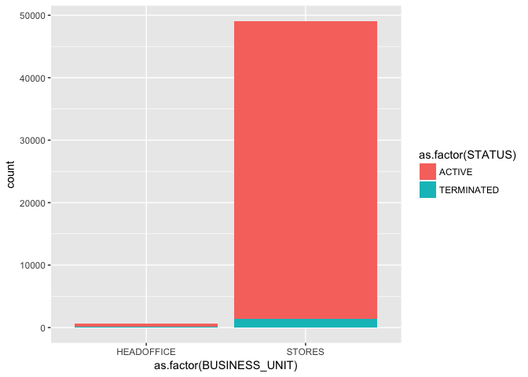
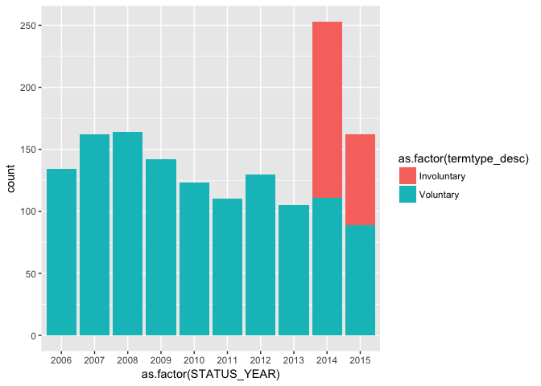
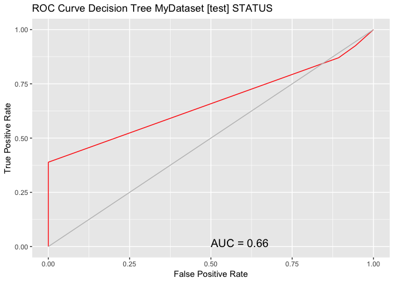
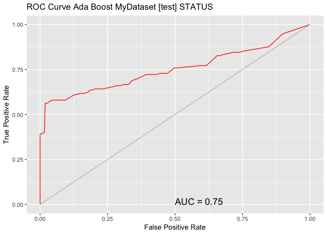
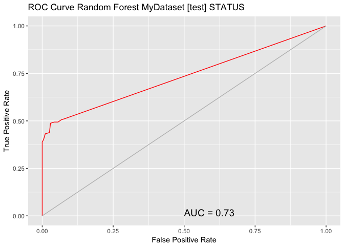
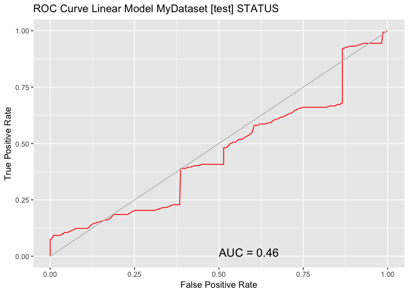

EmpAttrition
================
2017-10-06

### Load the dataset

``` r
data_dir <- "/Users/jeevarehakrishnaraj/Desktop/Springboard/EmployeeAttrition"
term_data <- read.csv(file.path(data_dir,"TermData_org.csv"),header = TRUE)
MYdataset <- term_data
str(MYdataset)
```

    ## 'data.frame':    49653 obs. of  18 variables:
    ##  $ EmployeeID         : int  1318 1318 1318 1318 1318 1318 1318 1318 1318 1318 ...
    ##  $ recorddate_key     : Factor w/ 130 levels "1/1/2006 0:00",..: 41 42 43 44 45 46 47 48 49 50 ...
    ##  $ birthdate_key      : Factor w/ 5342 levels "1941-01-15","1941-02-14",..: 1075 1075 1075 1075 1075 1075 1075 1075 1075 1075 ...
    ##  $ orighiredate_key   : Factor w/ 4415 levels "1989-08-28","1989-08-31",..: 1 1 1 1 1 1 1 1 1 1 ...
    ##  $ terminationdate_key: Factor w/ 1055 levels "1900-01-01","2006-01-01",..: 1 1 1 1 1 1 1 1 1 1 ...
    ##  $ age                : int  52 53 54 55 56 57 58 59 60 61 ...
    ##  $ length_of_service  : int  17 18 19 20 21 22 23 24 25 26 ...
    ##  $ city_name          : Factor w/ 40 levels "Abbotsford","Aldergrove",..: 35 35 35 35 35 35 35 35 35 35 ...
    ##  $ department_name    : Factor w/ 21 levels "Accounting","Accounts Payable",..: 10 10 10 10 10 10 10 10 10 10 ...
    ##  $ job_title          : Factor w/ 47 levels "Accounting Clerk",..: 9 9 9 9 9 9 9 9 9 9 ...
    ##  $ store_name         : int  35 35 35 35 35 35 35 35 35 35 ...
    ##  $ gender_short       : Factor w/ 2 levels "F","M": 2 2 2 2 2 2 2 2 2 2 ...
    ##  $ gender_full        : Factor w/ 2 levels "Female","Male": 2 2 2 2 2 2 2 2 2 2 ...
    ##  $ termreason_desc    : Factor w/ 4 levels "Layoff","Not Applicable",..: 2 2 2 2 2 2 2 2 2 2 ...
    ##  $ termtype_desc      : Factor w/ 3 levels "Involuntary",..: 2 2 2 2 2 2 2 2 2 2 ...
    ##  $ STATUS_YEAR        : int  2006 2007 2008 2009 2010 2011 2012 2013 2014 2015 ...
    ##  $ STATUS             : Factor w/ 2 levels "ACTIVE","TERMINATED": 1 1 1 1 1 1 1 1 1 1 ...
    ##  $ BUSINESS_UNIT      : Factor w/ 2 levels "HEADOFFICE","STORES": 1 1 1 1 1 1 1 1 1 1 ...

``` r
library(plyr)
library(dplyr)
```

    ## Warning: package 'dplyr' was built under R version 3.4.2

    ## 
    ## Attaching package: 'dplyr'

    ## The following objects are masked from 'package:plyr':
    ## 
    ##     arrange, count, desc, failwith, id, mutate, rename, summarise,
    ##     summarize

    ## The following objects are masked from 'package:stats':
    ## 
    ##     filter, lag

    ## The following objects are masked from 'package:base':
    ## 
    ##     intersect, setdiff, setequal, union

``` r
knitr::opts_chunk$set(echo = TRUE)
```

### Look at the data quality

``` r
summary(MYdataset)
```

    ##    EmployeeID           recorddate_key     birthdate_key  
    ##  Min.   :1318   12/31/2013 0:00: 5215   1954-08-04:   40  
    ##  1st Qu.:3360   12/31/2012 0:00: 5101   1956-04-27:   40  
    ##  Median :5031   12/31/2011 0:00: 4972   1973-03-23:   40  
    ##  Mean   :4859   12/31/2014 0:00: 4962   1952-01-27:   30  
    ##  3rd Qu.:6335   12/31/2010 0:00: 4840   1952-08-10:   30  
    ##  Max.   :8336   12/31/2015 0:00: 4799   1953-10-06:   30  
    ##                 (Other)        :19764   (Other)   :49443  
    ##    orighiredate_key terminationdate_key      age        length_of_service
    ##  1992-08-09:   50   1900-01-01:42450    Min.   :19.00   Min.   : 0.00    
    ##  1995-02-22:   50   2014-12-30: 1079    1st Qu.:31.00   1st Qu.: 5.00    
    ##  2004-12-04:   50   2015-12-30:  674    Median :42.00   Median :10.00    
    ##  2005-10-16:   50   2010-12-30:   25    Mean   :42.08   Mean   :10.43    
    ##  2006-02-26:   50   2012-11-11:   21    3rd Qu.:53.00   3rd Qu.:15.00    
    ##  2006-09-25:   50   2015-02-04:   20    Max.   :65.00   Max.   :26.00    
    ##  (Other)   :49353   (Other)   : 5384                                     
    ##            city_name             department_name          job_title   
    ##  Vancouver      :11211   Meats           :10269   Meat Cutter  :9984  
    ##  Victoria       : 4885   Dairy           : 8599   Dairy Person :8590  
    ##  Nanaimo        : 3876   Produce         : 8515   Produce Clerk:8237  
    ##  New Westminster: 3211   Bakery          : 8381   Baker        :8096  
    ##  Kelowna        : 2513   Customer Service: 7122   Cashier      :6816  
    ##  Burnaby        : 2067   Processed Foods : 5911   Shelf Stocker:5622  
    ##  (Other)        :21890   (Other)         :  856   (Other)      :2308  
    ##    store_name   gender_short gender_full          termreason_desc 
    ##  Min.   : 1.0   F:25898      Female:25898   Layoff        : 1705  
    ##  1st Qu.:16.0   M:23755      Male  :23755   Not Applicable:41853  
    ##  Median :28.0                               Resignaton    : 2111  
    ##  Mean   :27.3                               Retirement    : 3984  
    ##  3rd Qu.:42.0                                                     
    ##  Max.   :46.0                                                     
    ##                                                                   
    ##         termtype_desc    STATUS_YEAR          STATUS     
    ##  Involuntary   : 1705   Min.   :2006   ACTIVE    :48168  
    ##  Not Applicable:41853   1st Qu.:2008   TERMINATED: 1485  
    ##  Voluntary     : 6095   Median :2011                     
    ##                         Mean   :2011                     
    ##                         3rd Qu.:2013                     
    ##                         Max.   :2015                     
    ##                                                          
    ##     BUSINESS_UNIT  
    ##  HEADOFFICE:  585  
    ##  STORES    :49068  
    ##                    
    ##                    
    ##                    
    ##                    
    ## 

### Termination Proportion

``` r
StatusCount<- as.data.frame.matrix(MYdataset %>%
group_by(STATUS_YEAR) %>%
select(STATUS) %>%
table())
```

    ## Adding missing grouping variables: `STATUS_YEAR`

``` r
StatusCount$TOTAL<-StatusCount$ACTIVE + StatusCount$TERMINATED
StatusCount$PercentTerminated <-StatusCount$TERMINATED/(StatusCount$TOTAL)*100
StatusCount
```

    ##      ACTIVE TERMINATED TOTAL PercentTerminated
    ## 2006   4445        134  4579          2.926403
    ## 2007   4521        162  4683          3.459321
    ## 2008   4603        164  4767          3.440319
    ## 2009   4710        142  4852          2.926628
    ## 2010   4840        123  4963          2.478340
    ## 2011   4972        110  5082          2.164502
    ## 2012   5101        130  5231          2.485184
    ## 2013   5215        105  5320          1.973684
    ## 2014   4962        253  5215          4.851390
    ## 2015   4799        162  4961          3.265471

``` r
mean(StatusCount$PercentTerminated)
```

    ## [1] 2.997124

### Plots by Business Unit



### Plots by Term Type



### Build the model

#### Partition the data

``` r
library(magrittr)
building <- TRUE
 scoring  <- ! building
 set.seed(42)
 MYnobs <- nrow(MYdataset)
 MYsample <- MYtrain <- subset(MYdataset,STATUS_YEAR<=2014)
 MYvalidate <- NULL
 MYtest <- subset(MYdataset,STATUS_YEAR== 2015)
 
 # The following variable selections have been noted.
 MYinput <- c("age", "length_of_service",    "gender_full", "STATUS_YEAR", "BUSINESS_UNIT")
 MYnumeric <- c("age", "length_of_service", "STATUS_YEAR")

MYcategoric <- c("gender_full", "BUSINESS_UNIT")
MYtarget  <- "STATUS"
MYrisk   <-  NULL
MYident <-  "EmployeeID"
MYignore <- c("recorddate_key", "birthdate_key", "orighiredate_key", "terminationdate_key", "city_name", "gender_short", "termreason_desc", "termtype_desc","department_name","job_title", "store_name")
MYweights <-  NULL
MYTrainingData<-MYtrain[c(MYinput, MYtarget)]
MYTestingData<-MYtest[c(MYinput, MYtarget)]
```

### Model Selection

#### Decision Tree

``` r
#install.packages('rattle')
#install.packages('rpart')
#install.packages('rpart.plot')
#install.packages('RColorBrewer')
#library(rattle)
library(rpart.plot)
```

    ## Loading required package: rpart

``` r
library(RColorBrewer)
library(rpart, quietly=TRUE)
set.seed(42)

# Build the Decision Tree model.
MYrpart <- rpart(STATUS ~ .,
                   data=MYtrain[, c(MYinput, MYtarget)],
                   method="class",
                   parms=list(split="information"),
                   control=rpart.control(usesurrogate=0, 
                                         maxsurrogate=0))
#fancyRpartPlot(MYrpart, main="Decision Tree MFG10YearTerminationData $ STATUS")
```

#### Random Forest

``` r
library(randomForest, quietly=TRUE)
```

    ## randomForest 4.6-12

    ## Type rfNews() to see new features/changes/bug fixes.

    ## 
    ## Attaching package: 'randomForest'

    ## The following object is masked from 'package:ggplot2':
    ## 
    ##     margin

    ## The following object is masked from 'package:dplyr':
    ## 
    ##     combine

``` r
set.seed(42)
MYrf <- randomForest(STATUS ~ .,
                                   data=MYtrain[c(MYinput, MYtarget)],
                                   ntree=500,
                                   mtry=2,
                                   importance=TRUE,
                                   na.action=randomForest::na.roughfix,
                                   replace=FALSE)
MYrf
```

    ## 
    ## Call:
    ##  randomForest(formula = STATUS ~ ., data = MYtrain[c(MYinput,      MYtarget)], ntree = 500, mtry = 2, importance = TRUE, replace = FALSE,      na.action = randomForest::na.roughfix) 
    ##                Type of random forest: classification
    ##                      Number of trees: 500
    ## No. of variables tried at each split: 2
    ## 
    ##         OOB estimate of  error rate: 1.13%
    ## Confusion matrix:
    ##            ACTIVE TERMINATED  class.error
    ## ACTIVE      43366          3 6.917383e-05
    ## TERMINATED    501        822 3.786848e-01

``` r
# Calculate the Area Under the Curve (AUC).
#install.packages("pROC")
pROC::roc(MYrf$y, as.numeric(MYrf$predicted))
```

    ## 
    ## Call:
    ## roc.default(response = MYrf$y, predictor = as.numeric(MYrf$predicted))
    ## 
    ## Data: as.numeric(MYrf$predicted) in 43369 controls (MYrf$y ACTIVE) < 1323 cases (MYrf$y TERMINATED).
    ## Area under the curve: 0.8106

``` r
# Calculate the AUC Confidence Interval.
pROC::ci.auc(MYrf$y, as.numeric(MYrf$predicted))
```

    ## 95% CI: 0.7975-0.8237 (DeLong)

``` r
# List the importance of the variables.

rn <- round(randomForest::importance(MYrf), 2)
rn[order(rn[,3], decreasing=TRUE),]
```

    ##                   ACTIVE TERMINATED MeanDecreaseAccuracy MeanDecreaseGini
    ## age                36.51     139.70                52.45           743.27
    ## STATUS_YEAR        35.46      34.13                41.50            64.65
    ## gender_full        28.02      40.03                37.08            76.80
    ## length_of_service  18.37      18.43                21.38            91.71
    ## BUSINESS_UNIT       6.06       7.64                 8.09             3.58

#### Adaoost

``` r
set.seed(42)
#install.packages("ada")
library(ada)
MYada <- ada(STATUS ~ .,
                  data=MYtrain[c(MYinput, MYtarget)],
                  control=rpart::rpart.control(maxdepth=30,
                                               cp=0.010000,
                                               minsplit=20,
                                               xval=10),
                                               iter=50)
# Print the results of the modelling.

print(MYada)
```

    ## Call:
    ## ada(STATUS ~ ., data = MYtrain[c(MYinput, MYtarget)], control = rpart::rpart.control(maxdepth = 30, 
    ##     cp = 0.01, minsplit = 20, xval = 10), iter = 50)
    ## 
    ## Loss: exponential Method: discrete   Iteration: 50 
    ## 
    ## Final Confusion Matrix for Data:
    ##             Final Prediction
    ## True value   ACTIVE TERMINATED
    ##   ACTIVE      43366          3
    ##   TERMINATED    501        822
    ## 
    ## Train Error: 0.011 
    ## 
    ## Out-Of-Bag Error:  0.011  iteration= 6 
    ## 
    ## Additional Estimates of number of iterations:
    ## 
    ## train.err1 train.kap1 
    ##          1          1

``` r
round(MYada$model$errs[MYada$iter,], 2)
```

    ## train.err train.kap 
    ##      0.01      0.24

#### Linear Models

``` r
# Build a Regression model.

MYglm <-glm(STATUS ~ .,
             data=MYtrain[c(MYinput, MYtarget)],
             family=binomial(link="logit"))

# Generate a textual view of the Linear model.

print(summary(MYglm))
```

    ## 
    ## Call:
    ## glm(formula = STATUS ~ ., family = binomial(link = "logit"), 
    ##     data = MYtrain[c(MYinput, MYtarget)])
    ## 
    ## Deviance Residuals: 
    ##     Min       1Q   Median       3Q      Max  
    ## -1.3245  -0.2076  -0.1564  -0.1184   3.4080  
    ## 
    ## Coefficients:
    ##                       Estimate Std. Error z value Pr(>|z|)    
    ## (Intercept)         -893.51883   33.96609 -26.306  < 2e-16 ***
    ## age                    0.21944    0.00438  50.095  < 2e-16 ***
    ## length_of_service     -0.43146    0.01086 -39.738  < 2e-16 ***
    ## gender_fullMale        0.51900    0.06766   7.671  1.7e-14 ***
    ## STATUS_YEAR            0.44122    0.01687  26.148  < 2e-16 ***
    ## BUSINESS_UNITSTORES   -2.73943    0.16616 -16.486  < 2e-16 ***
    ## ---
    ## Signif. codes:  0 '***' 0.001 '**' 0.01 '*' 0.05 '.' 0.1 ' ' 1
    ## 
    ## (Dispersion parameter for binomial family taken to be 1)
    ## 
    ##     Null deviance: 11920.1  on 44691  degrees of freedom
    ## Residual deviance:  9053.3  on 44686  degrees of freedom
    ## AIC: 9065.3
    ## 
    ## Number of Fisher Scoring iterations: 7

``` r
cat(sprintf("Log likelihood: %.3f (%d df)\n",
            logLik(MYglm)[1],
            attr(logLik(MYglm), "df")))
```

    ## Log likelihood: -4526.633 (6 df)

``` r
cat(sprintf("Null/Residual deviance difference: %.3f (%d df)\n",
            MYglm$null.deviance-MYglm$deviance,
            MYglm$df.null-MYglm$df.residual))
```

    ## Null/Residual deviance difference: 2866.813 (5 df)

``` r
cat(sprintf("Chi-square p-value: %.8f\n",
            dchisq(MYglm$null.deviance-MYglm$deviance,
                   MYglm$df.null-MYglm$df.residual)))
```

    ## Chi-square p-value: 0.00000000

``` r
cat(sprintf("Pseudo R-Square (optimistic): %.8f\n",
            cor(MYglm$y, MYglm$fitted.values)))
```

    ## Pseudo R-Square (optimistic): 0.38428451

``` r
cat('\n==== ANOVA ====\n\n')
```

    ## 
    ## ==== ANOVA ====

``` r
print(anova(MYglm, test="Chisq"))
```

    ## Analysis of Deviance Table
    ## 
    ## Model: binomial, link: logit
    ## 
    ## Response: STATUS
    ## 
    ## Terms added sequentially (first to last)
    ## 
    ## 
    ##                   Df Deviance Resid. Df Resid. Dev  Pr(>Chi)    
    ## NULL                              44691    11920.1              
    ## age                1   861.75     44690    11058.3 < 2.2e-16 ***
    ## length_of_service  1  1094.72     44689     9963.6 < 2.2e-16 ***
    ## gender_full        1    14.38     44688     9949.2 0.0001494 ***
    ## STATUS_YEAR        1   716.39     44687     9232.8 < 2.2e-16 ***
    ## BUSINESS_UNIT      1   179.57     44686     9053.3 < 2.2e-16 ***
    ## ---
    ## Signif. codes:  0 '***' 0.001 '**' 0.01 '*' 0.05 '.' 0.1 ' ' 1

### Evaluate Models

#### Evaluate Decision Tree Using AUC

``` r
#install.packages("ROCR")
library(ROCR)
```

    ## Loading required package: gplots

    ## 
    ## Attaching package: 'gplots'

    ## The following object is masked from 'package:stats':
    ## 
    ##     lowess

``` r
library(ggplot2,quietly = TRUE)

# Generate an ROC Curve for the rpart model on MFG10YearTerminationData [test].

MYpr <- predict(MYrpart, newdata=MYtest[c(MYinput, MYtarget)])[,2]

# Remove observations with missing target.

no.miss <-  na.omit(MYtest[c(MYinput, MYtarget)]$STATUS)
miss.list<- attr(no.miss, "na.action")
attributes(no.miss)<- NULL

if (length(miss.list)){pred <- prediction(MYpr[-miss.list], no.miss)} else {pred<- prediction(MYpr, no.miss)}

pe <- performance(pred, "tpr", "fpr")
au <- performance(pred, "auc")@y.values[[1]]
pd <- data.frame(fpr=unlist(pe@x.values), tpr=unlist(pe@y.values))
ggplot(pd, aes(x=fpr, y=tpr)) + geom_line(colour = "red") + labs(x= "False Positive Rate", y = "True Positive Rate")+ggtitle("ROC Curve Decision Tree MyDataset [test] STATUS") + geom_line(data=data.frame(), aes(x=c(0,1), y=c(0,1)), colour="grey") + annotate("text", x=0.50, y=0.00, hjust=0, vjust=0, size=5,label=paste("AUC =", round(au, 2)))
```



##### Evaluate Adaboost Model

``` r
# Calculate the area under the curve for the plot.
# Remove observations with missing target.
no.miss  <-  na.omit(MYtest[c(MYinput, MYtarget)]$STATUS)
miss.list <- attr(no.miss, "na.action")
attributes(no.miss) <- NULL

if (length(miss.list)) {pred <- prediction(MYpr[-miss.list], no.miss)} else {pred <- prediction(MYpr, no.miss)}

performance(pred,"auc")
```

    ## An object of class "performance"
    ## Slot "x.name":
    ## [1] "None"
    ## 
    ## Slot "y.name":
    ## [1] "Area under the ROC curve"
    ## 
    ## Slot "alpha.name":
    ## [1] "none"
    ## 
    ## Slot "x.values":
    ## list()
    ## 
    ## Slot "y.values":
    ## [[1]]
    ## [1] 0.6619685
    ## 
    ## 
    ## Slot "alpha.values":
    ## list()

``` r
library(ROCR)
library(ggplot2, quietly=TRUE)

# Generate an ROC Curve for the ada model on MFG10YearTerminationData [test].
MYpr <- predict(MYada, newdata=MYtest[c(MYinput, MYtarget)], type="prob")[,2]
 no.miss <-   na.omit(MYtest[c(MYinput, MYtarget)]$STATUS)
 miss.list <- attr(no.miss, "na.action")
 attributes(no.miss) <- Brown <- NULL
 if (length(miss.list)){pred <- prediction(MYpr[-miss.list], no.miss)} else { pred <- prediction(MYpr, no.miss)}
 
pe <- performance(pred, "tpr", "fpr")
au <- performance(pred, "auc")@y.values[[1]]
pd <- data.frame(fpr=unlist(pe@x.values), tpr=unlist(pe@y.values))

ggplot(pd, aes(x=fpr, y=tpr)) + geom_line(colour="red") +labs(x= "False Positive Rate", y = "True Positive Rate") +ggtitle("ROC Curve Ada Boost MyDataset [test] STATUS") +geom_line(data=data.frame(), aes(x=c(0,1), y=c(0,1)), colour="grey") + annotate("text", x=0.50, y=0.00, hjust=0, vjust=0, size=5,label=paste("AUC =", round(au, 2)))
```



##### Evaluate Random Forest Model

``` r
# Remove observations with missing target.
no.miss  <-  na.omit(MYtest[c(MYinput, MYtarget)]$STATUS)
miss.list <- attr(no.miss, "na.action")
attributes(no.miss) <-Brown <- NULL
if (length(miss.list)) {pred <- prediction(MYpr[-miss.list], no.miss)} else {pred <- prediction(MYpr, no.miss)}
performance(pred, "auc")
```

    ## An object of class "performance"
    ## Slot "x.name":
    ## [1] "None"
    ## 
    ## Slot "y.name":
    ## [1] "Area under the ROC curve"
    ## 
    ## Slot "alpha.name":
    ## [1] "none"
    ## 
    ## Slot "x.values":
    ## list()
    ## 
    ## Slot "y.values":
    ## [[1]]
    ## [1] 0.7525726
    ## 
    ## 
    ## Slot "alpha.values":
    ## list()

``` r
library(ROCR)
library(ggplot2, quietly=TRUE)

# Generate an ROC Curve for the rf model on MyDataset [test].
 
MYpr <- predict(MYrf, newdata=na.omit(MYtest[c(MYinput, MYtarget)]), type="prob")[,2]

# Remove observations with missing target.

no.miss  <- na.omit(na.omit(MYtest[c(MYinput, MYtarget)])$STATUS)
miss.list <- attr(no.miss, "na.action")
attributes(no.miss) <- Brown <- NULL

if (length(miss.list)) { pred <- prediction(MYpr[-miss.list], no.miss)} else {pred <- prediction(MYpr, no.miss)}

pe <- performance(pred, "tpr", "fpr")
au <- performance(pred, "auc")@y.values[[1]]
pd <- data.frame(fpr=unlist(pe@x.values), tpr=unlist(pe@y.values))

ggplot(pd, aes(x=fpr, y=tpr)) + geom_line(colour="red") +labs(x= "False Positive Rate", y = "True Positive Rate") +ggtitle("ROC Curve Random Forest MyDataset [test] STATUS") +geom_line(data=data.frame(), aes(x=c(0,1), y=c(0,1)), colour="grey") + annotate("text", x=0.50, y=0.00, hjust=0, vjust=0, size=5,label=paste("AUC =", round(au, 2)))
```



#### Linear Model

``` r
# Remove observations with missing target.

no.miss   <- na.omit(na.omit(MYtest[c(MYinput, MYtarget)])$STATUS)
miss.list <- attr(no.miss, "na.action")
attributes(no.miss) <- NULL

if (length(miss.list)){pred <- prediction(MYpr[-miss.list], no.miss)} else{ pred <- prediction(MYpr, no.miss)}

performance(pred, "auc")
```

    ## An object of class "performance"
    ## Slot "x.name":
    ## [1] "None"
    ## 
    ## Slot "y.name":
    ## [1] "Area under the ROC curve"
    ## 
    ## Slot "alpha.name":
    ## [1] "none"
    ## 
    ## Slot "x.values":
    ## list()
    ## 
    ## Slot "y.values":
    ## [[1]]
    ## [1] 0.7332874
    ## 
    ## 
    ## Slot "alpha.values":
    ## list()

``` r
library(ROCR)
library(ggplot2, quietly=TRUE)

# Generate an ROC Curve for the glm model on MyDataset [test].
 MYpr <- predict(MYglm, type="response", newdata=MYtest[c(MYinput, MYtarget)])
 
 # Remove observations with missing target.

no.miss  <- na.omit(MYtest[c(MYinput, MYtarget)]$STATUS)
miss.list <- attr(no.miss, "na.action")
attributes(no.miss) <- Brown <- NULL
 
if (length(miss.list)){pred <- prediction(MYpr[-miss.list], no.miss)} else{ pred <- prediction(MYpr, no.miss)}

pe <- performance(pred, "tpr", "fpr")
au <- performance(pred, "auc")@y.values[[1]]
pd <- data.frame(fpr=unlist(pe@x.values), tpr=unlist(pe@y.values))

ggplot(pd, aes(x=fpr, y=tpr)) + geom_line(colour="red") +labs(x= "False Positive Rate", y = "True Positive Rate") +ggtitle("ROC Curve Linear Model MyDataset [test] STATUS") +geom_line(data=data.frame(), aes(x=c(0,1), y=c(0,1)), colour="grey") + annotate("text", x=0.50, y=0.00, hjust=0, vjust=0, size=5,label=paste("AUC =", round(au, 2)))
```



### Apply the model

``` r
# 2015 Dataset
Employees2016 <- MYtest
ActiveEmployees2016<-subset(Employees2016,STATUS=='ACTIVE')
ActiveEmployees2016$age<-ActiveEmployees2016$age+1
ActiveEmployees2016$length_of_service<-ActiveEmployees2016$length_of_service+1
ActiveEmployees2016$PredictedSTATUS2016<-predict(MYada,ActiveEmployees2016)
 PredictedTerminatedEmployees2016<-subset(ActiveEmployees2016,PredictedSTATUS2016=='TERMINATED')
```

### Total Terminated Employees

    ## [1] 93

### Top 5 records

    ##      EmployeeID  recorddate_key birthdate_key orighiredate_key
    ## 1551       1703 12/31/2015 0:00    1951-01-13       1990-09-23
    ## 1561       1705 12/31/2015 0:00    1951-01-15       1990-09-24
    ## 1571       1706 12/31/2015 0:00    1951-01-20       1990-09-27
    ## 1581       1710 12/31/2015 0:00    1951-01-24       1990-09-29
    ## 1600       1713 12/31/2015 0:00    1951-01-27       1990-10-01
    ## 1611       1715 12/31/2015 0:00    1951-01-31       1990-10-03
    ##      terminationdate_key age length_of_service     city_name
    ## 1551          1900-01-01  65                26     Vancouver
    ## 1561          1900-01-01  65                26      Richmond
    ## 1571          1900-01-01  65                26       Kelowna
    ## 1581          1900-01-01  65                26 Prince George
    ## 1600          1900-01-01  65                26     Vancouver
    ## 1611          1900-01-01  65                26      Richmond
    ##       department_name                job_title store_name gender_short
    ## 1551            Meats            Meats Manager         43            F
    ## 1561            Meats            Meats Manager         29            M
    ## 1571            Meats              Meat Cutter         16            M
    ## 1581 Customer Service Customer Service Manager         26            M
    ## 1600          Produce          Produce Manager         43            F
    ## 1611          Produce          Produce Manager         29            F
    ##      gender_full termreason_desc  termtype_desc STATUS_YEAR STATUS
    ## 1551      Female  Not Applicable Not Applicable        2015 ACTIVE
    ## 1561        Male  Not Applicable Not Applicable        2015 ACTIVE
    ## 1571        Male  Not Applicable Not Applicable        2015 ACTIVE
    ## 1581        Male  Not Applicable Not Applicable        2015 ACTIVE
    ## 1600      Female  Not Applicable Not Applicable        2015 ACTIVE
    ## 1611      Female  Not Applicable Not Applicable        2015 ACTIVE
    ##      BUSINESS_UNIT PredictedSTATUS2016
    ## 1551        STORES          TERMINATED
    ## 1561        STORES          TERMINATED
    ## 1571        STORES          TERMINATED
    ## 1581        STORES          TERMINATED
    ## 1600        STORES          TERMINATED
    ## 1611        STORES          TERMINATED

#### Export the Dataset

``` r
write.csv(PredictedTerminatedEmployees2016,file.path(data_dir,"Terminated.csv"))
```
